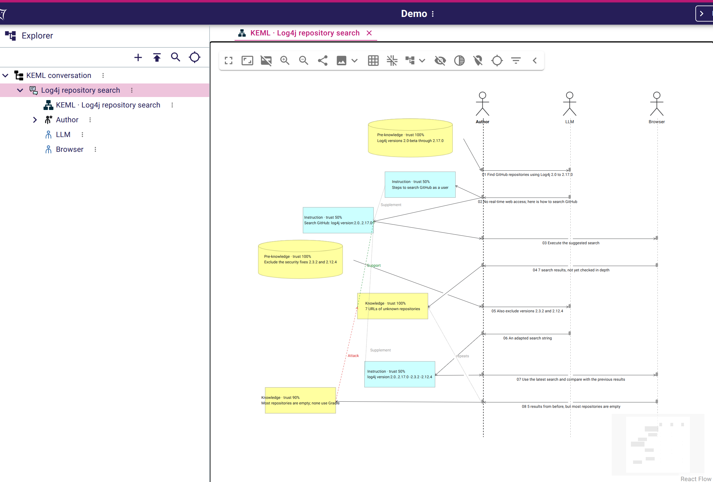
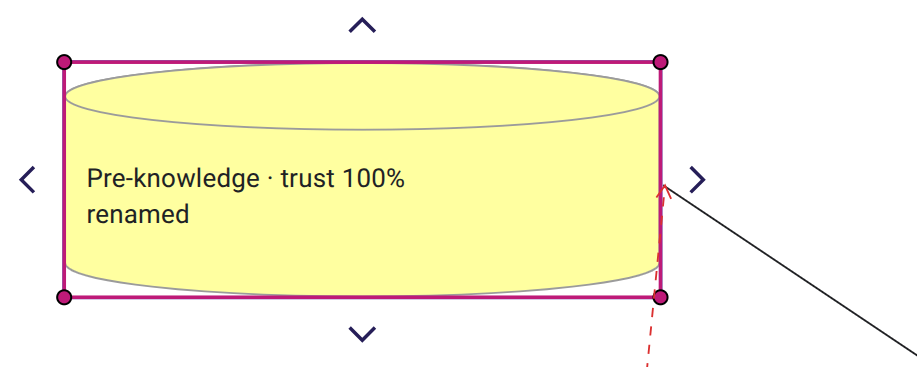
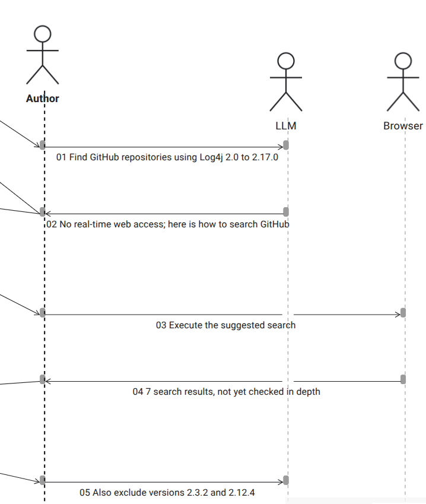
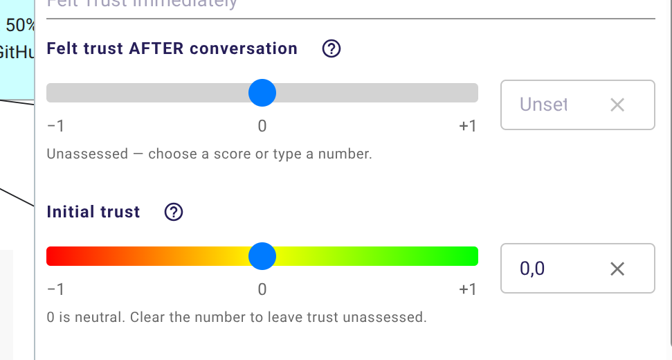
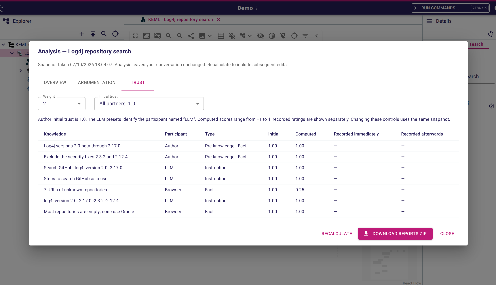

# KEML Sirius Web sample

This repository is an experiment in bringing KEML into Sirius Web.
If you are interested in KEML itself, visit the
[official KEML group](https://github.com/keml-group): that is where the language,
its tools and the KEML community are developed.

The experiment is useful as a working example or template for setting up a
Sirius Web application from an existing Ecore model and its EMF projects. It
demonstrates model registration, EMF Edit integration, diagrams defined in Java,
editing tools, project templates, frontend extensions and a runnable application
with PostgreSQL persistence. KEML provides the example domain: conversations,
participants, messages, knowledge and argument links.

The conversation editor combines a layout inspired by sequence diagrams with a
knowledge graph:



## What this example demonstrates

* **From an Ecore metamodel to a web application:** reuse an existing EMF model,
  its generated Java code and Edit providers to supply model creation, labels,
  icons and editable properties in Sirius Web.
* **SVG images throughout the editor:** vector shapes for participants,
  plus distinct model and creation-tool icons. Support and attack
  links have matching green/red icons, including variants for strong links.
* **A programmatic custom diagram node:** pre-knowledge uses a cylinder drawn
  at its current size, with a wrapped label and multiline ellipsis inside its
  body. Edge anchors follow the curved outline. The example contributes a Java
  runtime style, GraphQL schema, React renderer, converter and layout handler
  through Sirius Web's extension points, while reusing its editing tools.

  

* **A conversation diagram with editing tools:** combine a message timeline and
  knowledge graph, defined with Sirius Web's Java builders and AQL services.
  Create participants, messages, facts, instructions and argument links directly
  from their palettes.
* **A custom layout inspired by sequence diagrams:** align participants along
  vertical lifelines, order messages down the conversation timeline, and arrange
  related knowledge cards alongside it. A diagram post-processor applies this
  layout in Sirius Web, showing how to position elements for a specific domain.

  

* **Conversation analysis inside the application:** open **Analyse conversation…**
  from the Explorer to inspect conversation statistics, argument relationships
  and trust scenarios. Adjust scenario controls and recalculate results from a
  fresh model snapshot without changing the conversation.
* **CSV and Excel exports:** download a ZIP containing conversation and
  argumentation CSV reports and trust-scenario workbooks. Export the snapshot
  displayed in the analysis dialog, or generate reports from the Details view.
* **A frontend extension using the standard Sirius Web workbench:** contribute
  an Explorer action and a custom React results dialog through frontend extension
  points. Maven builds and packages the extended frontend into the Java app.
* **A custom widget for the Details view:** edit felt trust after a conversation,
  and initial trust for pre-knowledge, with a red/yellow/green slider and a
  synchronized numeric input. Java form descriptions and a React widget
  contribution reuse Sirius Web's standard editing flow, with backend validation
  and a distinct gray state for unassessed values.

  

* **A project template with a worked example:** the **KEML Conversation** template
  has its own illustration and initializes an editable example conversation.
  It shows how to contribute a template and populate its model using Sirius Web's
  standard project-creation services.
* **A complete Maven and release-engineering setup:** a parent POM defines the
  full reactor, shared versions and dependencies. One build compiles and tests
  the backend, builds the frontend, and produces an executable Spring Boot JAR
  containing the application and its web assets.
* **Eclipse and m2e integration:** all eight Maven projects include Eclipse
  project descriptors. Generated EMF sources are included, and a shared Java
  launch configuration lets you run or debug the application from Eclipse.
* **Java and Docker launch setups:** application profiles, a startup banner,
  a Java 21 Docker image running as a non-root user, and Docker Compose with
  PostgreSQL and a persistent database volume. The sample includes the
  configuration and instructions to build, launch and adapt the application.

The frontend extension adds conversation analysis, trust scenarios and report
downloads:



## Projects

| Project | What it does |
| --- | --- |
| [`keml`](keml/) | Defines the KEML Ecore metamodel and GenModel, with generated Java interfaces, implementations and validation. The generated sources are included so Maven can build the model directly from a checkout. |
| [`keml.edit`](keml.edit/) | Provides the EMF Edit adapters that supply model labels, SVG icons and editable properties to Sirius Web's explorer and Details view. Its icons are also reused by diagram creation tools. Customized generated methods use `@generated NOT`. |
| [`keml.io`](keml.io/) | Provides the existing KEML file-loading and serialization utilities, including JSON support and conversion from yEd/GraphML diagrams. These utilities support the analysis library and upstream command-line tools. |
| [`keml.analysis`](keml.analysis/) | Analyses conversation statistics, argument relationships and trust scenarios. Exposes reusable Java results and CSV/Excel report generation, used by the sample application's analysis feature. It also retains the upstream standalone analysis entry points. |
| [`keml.diagram`](keml.diagram/) | Defines the Sirius Web conversation timeline and knowledge graph, their node and edge creation tools, AQL services and layout. Contributes the **KEML Conversation** project template and example model. The module can be reused by another Sirius Web application. |
| [`keml.frontend`](keml.frontend/) | Builds a React/Vite frontend using Sirius Web's published workbench components. Adds the **Analyse conversation…** dialog with Overview, Argumentation and Trust tabs, scenario controls and report download, a custom trust widget in Details, and the programmatic pre-knowledge cylinder node. Its frontend assets are packaged for the Java application. |
| [`keml.app`](keml.app/) | Launches the standalone Spring Boot application. Registers the EMF package and adapter factory, installs the diagram contributions, exposes analysis and report endpoints, and supplies application configuration and the startup banner. Produces the executable `keml.jar`. |
| [`keml.releng`](keml.releng/) | Supplies the parent POM and complete Maven reactor, shared dependency versions and build configuration. Includes the Dockerfile, Docker Compose setup for the application and PostgreSQL, and detailed build, Eclipse import and launch documentation. |
| [`web-editor`](web-editor/) | Contains the upstream KEML web editor's published static assets, retained as a reference for the Sirius Web experiment. It is outside the Maven reactor. |

To adapt this sample to another Ecore model, start with
[`KemlApplication`](keml.app/src/main/java/keml/app/KemlApplication.java) and
[`KemlEMFConfiguration`](keml.app/src/main/java/keml/app/KemlEMFConfiguration.java)
for application setup and domain registration, then
[`KemlViews`](keml.diagram/src/main/java/keml/diagram/KemlViews.java) for the diagram
and editing tools. The application code includes comments explaining these
integration points.

## Build and run

Build the complete reactor from this directory:

```sh
mvn -f keml.releng/pom.xml clean verify
```

See the [application README](keml.releng/README.md) for prerequisites, Eclipse
import, Docker and Java launch instructions, and implementation examples.
The [upstream repository revisions](keml.releng/README.md#source-repositories-and-baseline-commits)
record the origins of the pre-existing code before repository consolidation.

## Continuous integration and application downloads

The [Build and test workflow](.github/workflows/build.yml) runs on pushes to
`main`, pull requests and manual dispatch. It builds the complete Maven reactor
with Java 21, runs the Java and frontend geometry tests, and type-checks and bundles the frontend.
Test failures fail the build; test reports are uploaded even when the build fails.

To download the Java application, open the repository's
[Actions page](https://github.com/cbrun/keml-on-sirius/actions/workflows/build.yml),
select a successful **Build and test** run, and download the
**keml-java-application** artifact from its summary or **Artifacts** section.
Extract the ZIP to obtain `keml.jar`. Artifacts are retained for 30 days;
the **test-reports** artifact contains the Maven test results.
[GitHub requires you to sign in to download workflow artifacts](https://docs.github.com/en/actions/managing-workflow-runs-and-deployments/managing-workflow-runs/downloading-workflow-artifacts).

The downloaded application includes its frontend and dependencies. You need
Java 21 and PostgreSQL to run it; Maven and Node are only needed to build it.
Start the sample database using the checked-out Compose configuration, then
launch the downloaded JAR:

```sh
docker compose -f keml.releng/docker-compose.yml up -d database
java -jar /path/to/keml.jar --spring.profiles.active=dev
```

Open <http://localhost:8080>. See the
[launch documentation](keml.releng/README.md#run-with-java-or-eclipse) for database
configuration when running elsewhere.

The workflow authenticates to the Sirius Maven and npm registries with the
automatic `GITHUB_TOKEN`, granting only `contents: read` and `packages: read`.
If your dependencies require additional package access, configure the repository
secret **PACKAGES_READ_TOKEN** with a personal access token (classic) with
`read:packages`, and the repository variable **PACKAGES_USERNAME** with its
owner's GitHub username. These optional values override the automatic credentials.
See [GitHub's package authentication documentation](https://docs.github.com/en/packages/working-with-a-github-packages-registry/working-with-the-apache-maven-registry#authenticating-in-a-github-actions-workflow).
